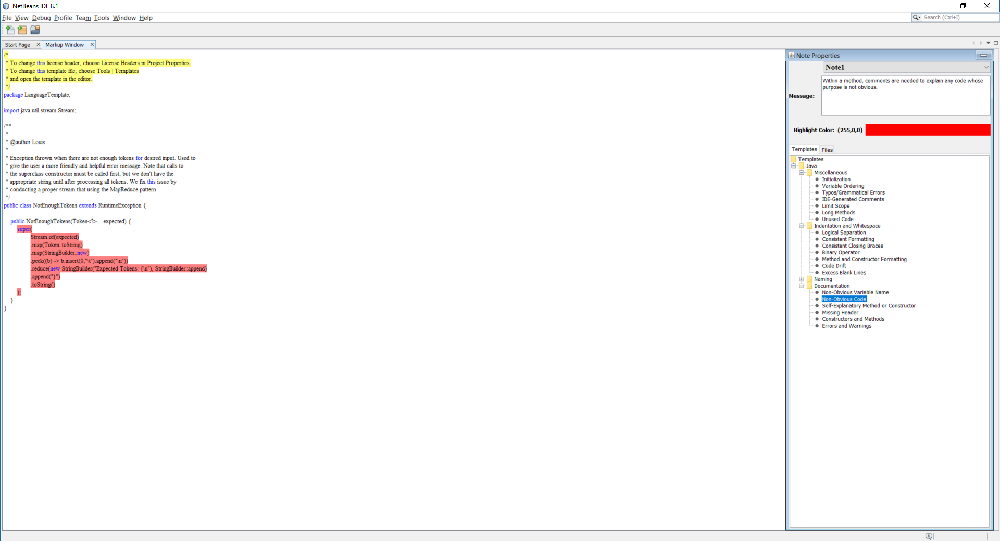
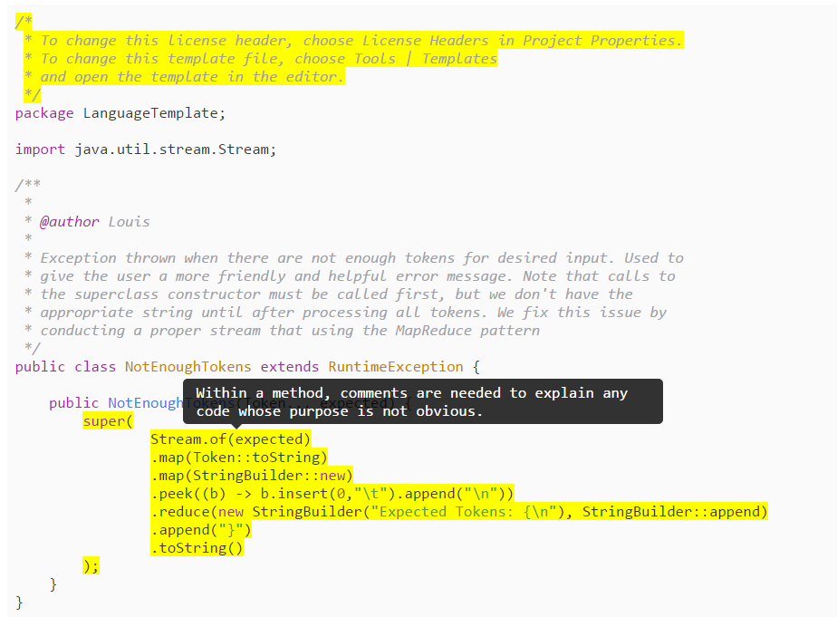

# Code Glosser

## Introduction

This work has been produced for an Independent Study at Bloomsburg University by me, Louis Jenkins, under the supervision of Drue Coles. This Independent Study
has taught me a surprising amount, and not all are purely technical detail as some even relate to how I see my future. Without any disrespect to Bloomsburg University,
the Department of Mathematical and Digital Sciences, or even Drue Coles, I would like to mention that this experience has further solidified my resolve to go graduate
school over that of industry after graduation. It isn't that the work is necessarily very challenging, but it comes down to the tedium behind software engineering.
However, I did learn quite a few technical things, so it also had it's upsides as well.

### Down Sides

One of the things I learned to dislike, stems from my reasoning for going into computer science, was the lack of a challenge. At first, it was fun in that I got to learn
to use the Java Swing framework, which associated with it is the major disappointments and "work-arounds" needed just to develop a simple application. I personally love
challenges, and the things I find challenging relate to academic research, which involves learning something completely new. I was no stranger to Java, and in fact it is
my most fluent language next to C, and so there was no challenge there. The Java Swing framework, while is remotely "challenging", it's challenges stem from it's short-comings,
such as the abundant amount of boilerplate code that one has to write to get even the most fundamental functionality. Another thing I disliked about it is that the project 
it felt more like I was a contractor rather than a researcher.

### Up Sides

Quite a few things I've learned is that the process for taking a product from conception to production is a very daunting one. Even now, while the actual specifications of the
application are fulfilled, there are plenty of bugs that need to be fixed and other potential features that need implementing before it can be considered "complete". It does
give me new-found respect for the massive amount of patience it takes to do just that, and as well I think the "80:20" rule definitely applies in this case.

Another thing I've learned is to actually plan out the design of software first, and even while writing this report I've even "simplified" the model to the point where it can be
described in the diagrams below, and which are significant changes and refactorings I can make to the project. Stemming from this, I know now that while design patterns are
helpful, they are detrimental when used where not needed. I suppose it could be said I learned the "K.I.S.S", which simply put, means to "keep it simple".

<P style="page-break-before: always">

## Summary

Code Glosser is an academic-enrichment tool that provides a user-friendly way for instructors to markup student assignments and provide the necessary feedback
for their students. Markups are used to provide feedback to students who need it and 'highlight' code similar to how a yellow marker would. This highlighting
makes it easy for students to determine precisely where the instructor deemed that feedback was necessary.

## Features

Why should you use Code Glosser?

### Portability

Code Glosser makes use of the NetBeans IDE platform as the base of distribution, and makes use of Java Swing for the GUI (or Graphical User Interface). Code Glosser
is meant to be portable not only for instructors, but in particular to the students, as soon, the plugin will be available to the NetBeans Plugin Portal, which is
for instructors, and the marked-up versions of documents will exported into HTML (with CSS and JavaScript). The design decision to export these markups has greatly
improved the viability of the application, as now only the instructors need the actual plugin.

### Effortless Feedback

Markups may also be applied directly from user-provided templates, upon which currently is in a rough state, but will improve over time. The templates are imported from
a JSON file, of which the details about the format and naming convention are discussed below. Templates are a quick and easy way to save time by recycling commonly-made
mistakes by students, and is one of the greatest points of this project, as the amount of time and effort saved from this feature cannot be understated. One of the problems
today with grading is that professors will not leave feedback on a user's assignment because of the sheer amount of effort it takes to write them, while those that do normally
go about it the wrong way, even going as far as printing out programs just to write on them. By applying feedback in such a few clicks, makes both grading and leaving
feedback at the same time almost effortless.

### Mass-Grading

Code Glosser allows the ability to not only markup a single file, but multiple files, and in fact, an entire project. Code Glosser allows you to switch between project files
while also preserving markups between files, and even export them all at once. So not only is marking up individual files extremely fast, but it turns a nightmare of grading
multiple project files into a much more manageable one.

Exported projects, as discussed below, preserve overall project structure, and all marked-up files are placed within a 'zip' archive, which makes distribution even easier.
The HTML generated is powered by 'highlight.js' and as such requires online connectivity to view the files properly. The HTML shown in the NetBeans plugin is currently in
a very rough state, as such does not represent the final state of the project.

### Language Support

The languages that Code Glosser supports is also very limited in that, due to the reliance on Java Swing, which does not support a way to use 'highlight.js' directly,
will initially only composed of Java, C, and C++. This should however cover majority of languages taught by instructors, and hopefully soon there will be a way to support
any arbitrary language, otherwise in the meantime, the syntax highlighting must be done by hand.

<P style="page-break-before: always">

## Screenshots

It sounds too good to be true, show me the proof!

### Proof of "Effortless Feedback"

#### Applying a Template

One of the most important features: using templates to save time and effort. Note however that the NetBeans editor shows a rather
"ugly" and rough view of the source code, but bear in mind that does not carry over into the actual final presentation (as in, the exported
HTML). Two templates are applies below, one addresses (very annoying) NetBeans generated headers, and another leaving feedback that maybe that
the code may not be the most readable... (of course as the creator, I think it is, but that's besides the point). Markups can have different colors
as a way to distinguish certain logical groupings of feedback. For example, is it related to "Naming", is it related "Documentation", etc. This coloration
is not visible to the student, so there is no cause for alarm if the user sees their code marked up in red, when it was just an arbitrary choice of color.



<P style="page-break-before: always">

#### HTML Exported

As mentioned above, the presentation layer is much better looking, as it uses a very well-establish library for syntax highlighting, 'highlight.js'. The highlights
are all yellow, and when the student hightlights over it, the left markup is visible. As can be seen, this is also not also very easy and trivial to do, it is also
aesthetically appealing (to the developer) to view feedback in this manner.



<P style="page-break-before: always">

## Implementation

### Templates

As discussed above, we can apply user-provided templates to make marking up as effortless as possible, in particular for commonly given feedback.
Now I'll discuss the 'How'.

#### Format

Even though JSON is a very easy-to-learn languagae, there is still a specific format you must follow, as the parser needs to understand. However, I believe
an actual example is better. The below is the template used in the screenshots above. The root object must be named `"templates"`, which is a JSONArray of
of either `"category"` (which contains a `"title"` and `"body"` field) or a `Markup` object (which contains a `"title"`, `"message"`, and `"color"` field).

```json
{
    "templates": [
        {
            "category":true,
            "title":"Java",
            "body": [
                {
                    "category":true,
                    "title":"Naming",
                    "body":[
                        {
                            "title":"Variable Names", 
                            "message":"Use lowerCamelCase for variables names", 
                            "color":"#00FFFF"
                        },
                        {
                            "title":"Method Names", 
                            "message":"Use lowerCamelCase verbs or verb phrases for method names.", 
                            "color":"#00FFFF"
                        },
                        {
                            "title":"Class Names", 
                            "message":"Use UpperCamelCase nouns or noun phrases for class names.", 
                            "color":"#00FFFF"
                        },
                        {
                            "title":"Magic Numbers", 
                            "message":"Use named constants instead of multiple occurrences of the same numerical literal.", 
                            "color":"#00FFFF"
                        },
                        {
                            "title":"Descriptive Naming", 
                            "message":"Use descriptive names for identifiers except for local variables whose purpose is completely obvious (such as loop counters).", 
                            "color":"#00FFFF"
                        },
                        {
                            "title":"Constant Case", 
                            "message":"Use CONSTANT_CASE for variables declared final if they are primitive-type variables or references to immutable types (like Color or String).", 
                            "color":"#00FFFF"
                        }
                    ]
                }
            ]
        }
    ]
}
```

<P style="page-break-before: always">

### Control Flow

For any curious reader interested in 'how it works', and as well the 'why' behind my design choices, I shall discuss them below.

#### Reacting to Events with rxJava's Observables

Through the usage of rxJava, we can propagate events in a 'push' based notification-style event system, where one Event can
traverse through each component in the system to another, and so on and so forth. For example, if the user needs to change the color
of the currently selected `Markup`, then the View displaying it must also be updated to display those changes. As well, if the View
creates a new `Markup`, then the properties panel needs to be updated to display it.

As there are many possible events that need to notify other parts of the system, and the fact that events can occur at any time, we need
a way to notify all interested listeners.

#### Events

Events are made up like such...

```java
class Event {
    public final int tag;
    public final Object data;
}
```

The `tag` lets us know what kind of event this is, and the `data` serves as an opaque handler for passing around data, of which the `tag` can
be used to identify the type of. For example, if the `tag` is `CREATE_MARKUP` and we know that this can only be sent from the View, we know then
that `data` holds the type `List<Bounds>` object, and we may safely cast to that. Events such as this can be used to create even more events and 
pass these Events around. The reasoning behind not using subclasses of this type is simple: Unlike other languages, Java does not allow pattern matching
based on it's type. Sure, we can use `instanceof`, to determine the exact type, but that's a lot more long-winded than just doing it by tag. As well,
`Event` is a POJO object: A Plain Old Java Object, and as such does not need that much complexity.

<P style="page-break-before: always">

#### How do we handle these Events? 

An example of event propagation would be the `MarkupController`, which handles all of the heavy-lifting of the application.
In the below snippet, you can see how it's event handler can be implemented in a very concise, and elegant manner.

```java
observer.onEvent()
    .flatMap(e -> {
        Function<Object, Observable<Event>> dispatchHandler;
        switch (e.tag) {
            case Event.CREATE_MARKUP:
                dispatchHandler = this::createMarkup;
                break;
            case Event.MARKUP_MUTATION:
                dispatchHandler = this::markupMutation;
                break;
            case Event.MARKUP_SELECTION:
                dispatchHandler = this::markupSelection;
                break;
            case Event.FILE_CHANGE:
                dispatchHandler = this::fileChange;
                break;
            case Event.CLOSING:
                dispatchHandler = this::closeHandler;
                break;
            default:
                dispatchHandler = ignored -> Observable::empty;
        }
        return dispatchHandler.apply(e.data);
    })
    .subscribe(this::sendEvent);
```

For those unfamiliar with Java 8, the syntax may look unfamiliar, so I will give an overall summary of what is going on here.

`observer` would be an rxJava `Observable`, which allows push-based notifications, when an event is emitted from the source `Observable`. The source
in this instance would be either from `MarkupView` or `MarkupProperties` as those two are the only ones capable of sending events directly.
By calling `subscribe`, we become an `Observer`, and the callback provided, `this::sendEvent` which is a method we decide who to send the events to,
and therefore propagating, is called on each event emitted. So for example, if the `MarkupView` notified us that the `CREATE_MARKUP` event occurred, we
handle this by calling our `dispatchHandler` and send the resulting event to `MarkupProperties`

Operators, like `flatMap`, provide a new `Observable` that, put simply, will perform those actions before passing onwards. So, `flatMap` will take
the `Event` object, map it and construct a new `Observable`. The reasoning behind creating a new Observable is that the `dispatchHandler` may well perform
some alterations on the pipeline. For example, `fileChange` will handle all I/O operations in a background thread and then continue on the UI Thread, 
and an `Observable` can specify what work should be done on which thread and even coordinate work that way.

The `dispatchHandler` is more for clarity, to help the reader understand what is going on: `Function` is a Java 8 construct that represents a function that
allows application. Application meaning "applying an argument" later. A Method Reference can be safely be stored in a `Function`. A `Function` of type
`Function<T,R>` is a function that takes `T`, and returns `R`. So, `Function<Object, Observable<Event>>` is a function that takes `Object` and returns `Observable<Event>`.
In the `default` statement, a lambda takes the form `(n0, n1, ... nk) -> { }`, but a single argument lambda does not need parenthesis surrounding it. As well a 
single line lambda does not need to be wrapped in a block, hence something like `Function<Integer, Integer> add2 = x -> x + 2` is a valid expression,
as a lambda expression can also fit within a `Function`.

While this may seem daunting at first, once understood, it makes code a lot more clean and easy to read.

<P style="page-break-before: always">

#### Diagram

To help the reader to understand the significance of this design, let us first look at the graph of all possible UI Events, which again, can happen at any time.


The `MarkupController` is at the top because it is where all events must go to communicate with the other view. `MarkupView` is the view which displays the user's code and allows
the user the ability to create and delete markups, as the like. `MarkupProperties` displays the 'Attributes' of each `Markup`, for example it's message, it's color, and it's identifier.
The `MarkupProperties` contains 4 children, all of which accept UI Events. For example, selecting another `Markup` by it's identifier is such an event, and so is applying a user-provided
template.

#### Concrete Examples of Event Propagation

While the above may seem confusing to the reader, hopefully the below examples can help in providing clarity. We are not going over all possible events, as they
are many, but I will display the more important ones.

<P style="page-break-before: always">

##### Create Markup

To create a markup, the user first highlights the code in the view, right clicks, and selects "Create Markup". If the selected boundary is not already occupied with another markup, 
then after segmenting the selected boundary to exclude extra white spaces, it must begin notifying of the event.


1. `MarkupView` receives UI-Event to "Create Markup" from it's context menu
2. `MarkupView` determines if the selected boundary is already occupied by another markup. If it is not occupied, segment selected bounds to exclude excess white spaces
3. `MarkupView` notified `MarkupController` of the event, with the segmented `Bounds`
4. `MarkupController` constructs a new `Markup` with a generated identifier and the passed `Bounds`, then maps it to it's identifier.
5. `MarkupController` notifies `MarkupProperties` of the new `Markup`.
6. `MarkupProperties` notifies `Selector` to update it's list of identifiers and display it.
7. `MarkupProperties` notifies `Attributes` to update it's view with the new `Markup` as the model.

<P style="page-break-before: always">

##### Select Markup

Selecting a markup occurs in the `Selector`, and it displays a dropdown menu of all currently existing markups.


1. `Selector` receives UI-Event to change markup based on id.
2. `Selector` constructs an event composed of the selected identifier, then notifies it's parent `MarkupProperties`
3. `MarkupProperties` notifies `MarkupController`
4. `MarkupController` finds the `Markup` by the selected identifier, then notifies `MarkupProperties` of a change.
5. `MarkupProperties` notifies `Attributes` to update it's view based on the passed Model.
6. `MarkupController` notifies `MarkupView` of this change by constructing an event that is composed of the `Markup` boundary.
7. `MarkupView` sets cursor to the start and end postion of the passed `Bounds`


<P style="page-break-before: always">

##### Apply Templates

Applying a template occurs in the tabbed view, and is invoked by double clicking on the `TreeView` leaf.


1. `Templates` receives UI-Event to apply template
2. `Templates` constructs an event composed of the partially filled `Markup` used as the template, and notifies `MarkupProperties`
3. `MarkupProperties` notifies `Attributes` to update it's view based on the partially filled `Markup`
4. `MarkupProperties` notifies `MarkupController` which updates it's `Markup` based on the template
5. `MarkupController` checks if the template changed the color, and if so, notifies `MarkupView` with an event composed of the boundary and new color.
6. `MarkupView` updates color of highlights within passed `Bounds`

<P style="page-break-before: always">

##### File Change

A file change, also triggered from double clicking a `TreeView` in the 'Files' tab, is rather complicated. Firstly, the file change needs to update the current
user session, and by doing that it needs to do some I/O. Because I/O should never be done one the UI Thread, we need to compose it on the background thread, and that becomes
difficult if a UI event can occur at any given time. Doing I/O on the UI thread will cause a stall in user performance, which is unacceptable, but race conditions can arise
when the background thread is reading and writing I/O and the user triggers another event. This is why the original solution of using Guava's `EventBus` would not work, but with
rxJava it can because events are sent sequentially, even if it is on a background thread.

To summarize the issue of this using an `EventBus`, it arises when we need to force the UI Thread to not do any more work until after work is finished on the background thread. Now,
the UI thread should not block, and so it should continue processing other UI Events, and also it needs to continue where it left off after the background threead finished. As well,
imagine another scenario where the user decides to do a file change, and double clicks on two different files at the same time: What happens is that it sends two different 'File Change'
events on the `EventBus` and spawns two background threads, each of which is going to be attempting to write to the same file, and while file access is serialized, both will end up attempting
to get the attention of the UI Thread and will leave the program in an undefined state.

`File` needs to read the contents of the selected file on disk before continuing, and since there is only one background thread, all subsequent File Change events must wait anyway until the
background thread finishes it's current task. The `MarkupController` must also first write all `Markup` instance to disk for this file before continuing AND read all `Markup` instances of the new file,
on the same background thread, and again, all subsequent File Change events must wait. Hence, it becomes free of race conditions.


<P style="page-break-before: always">

1. `Files` recevies UI-Event to change file
2. `Files` schedules the background thread to read the selected `File` in advance.
3. `Files` constructs an event of the contents of the selected `File`, and notifies `MarkupProperties`
4. `MarkupProperties` notifies `MarkupController`
5. `MarkupController` schedules the background thread to read the session data in, get the new file's session data and update for the old one
6. `MarkupController` constructs an event composed of the list of `Markup`s to `MarkupProperties`
7. `MarkupProperties` constructs an event composed of list of identifier and notifies `Selector`
8. `Selector` updates it's list of identifiers with the event's list.
9. `MarkupProperties` notifies `Attributes` to clear it's currently displayed data
10. `Attributes` clears displayed data.
11. `MarkupController` notifies `MarkupView` with list of pairs of lists of `Bounds` and `Color` for each `Markup` restored. 

<P style="page-break-before: always">

##### Mutate Markup

Mutating the currently selected `Markup` is done through `Attributes`. It's simpler than a few examples of the above.


1. `Attributes` receives UI-Event to mutate current `Markup`
2. `Attributes` constructs an event composed of partially applied `Markup` based on the changed information and notifies `MarkupProperties`
3. `MarkupProperties` notifies `MarkupController`
4. `MarkupController` applies these changes to the currently selected `Markup`
5. `MarkupController` notifies `MarkupView` if the color changed.
6. `MarkupView` changes the color of the markup highlights.

<P style="page-break-before: always">

### Preserving Project Structure

Project structure is preserved when generating markups. Non-marked up files are not generated, but the paths of the
marked up files are.


#### Picture

Imagine a file-tree hierachy beginning at the root `Project_Name`, which contain many sub-directories and even files. For simplicity, I will denote (and document)
the process of how I envision a project to look like.

```
Legend:
    [N]: A directory containing N children (either other directories, dubbed sub-directory, or valid source files)
    (N): A file containing N markups

Project_Name
    |-> Directory [3]
    |       |-> SubDirectory0 [1]
    |       |       |-> File1 (8)
    |       |-> SubDirectory1 [0]
    |       |-> File2 (7)
    |-> File3 (6)
    |-> File4 (0)
```

Note that some files may contain 0 markups, or there may be some sub-directories without valid files or even be empty. This must be taken into account when printing all to HTML,
as we do not want to waste the student's time when they are deciding which files actually have markups on them. Imagine that only sub-directories containing valid source files 
are considered valid, and that files containing at least 1 markup are valid. How might we go about deciding which files have markups and which do not? Simple, we check the session
data for this project: If the file contains any session data containing markups, it will be generated. Only sub-directories containing aforementioned files will be generated in the
.zip file.

```
Project_Name
    |-> Directory
    |       |-> SubDirectory0
    |       |       |-> File1.html
    |       |-> File2.html
    |-> File3.html
```

Hopefully this is easy to see: By filtering any non-used files and directories, it becomes trivial to export.