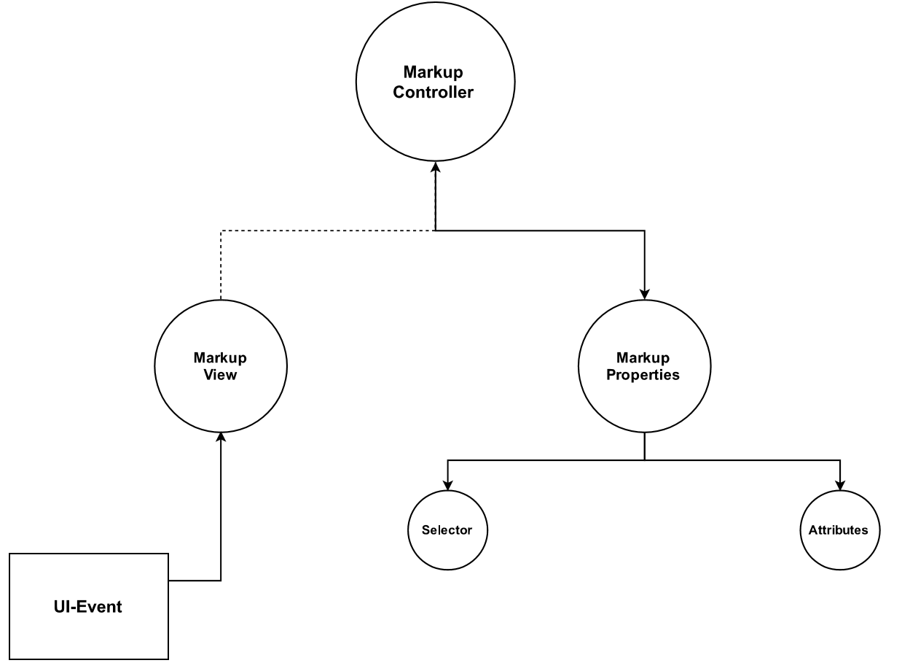
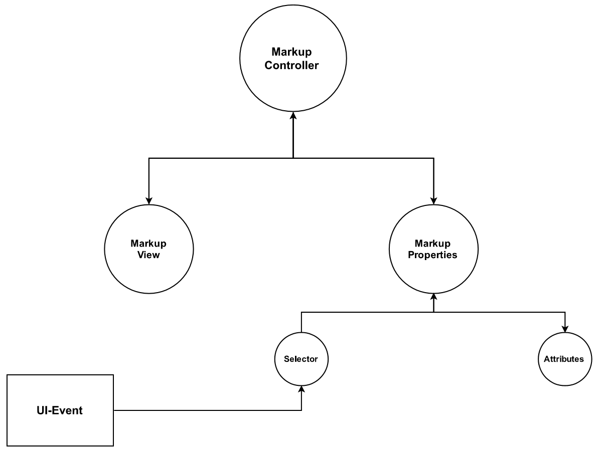
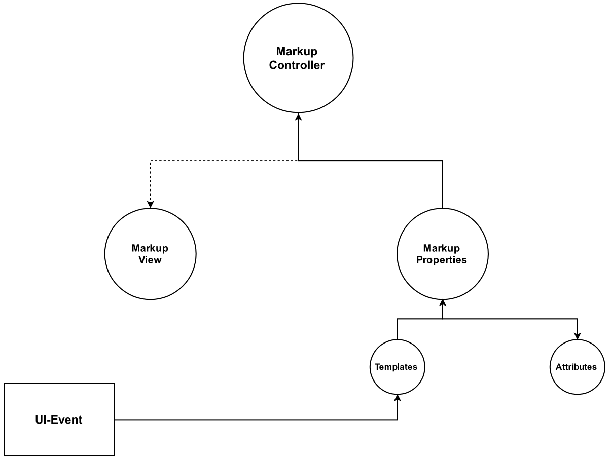
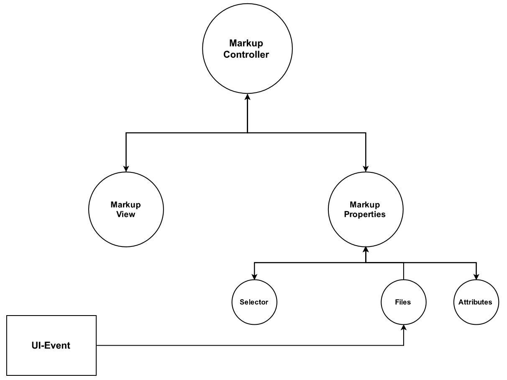
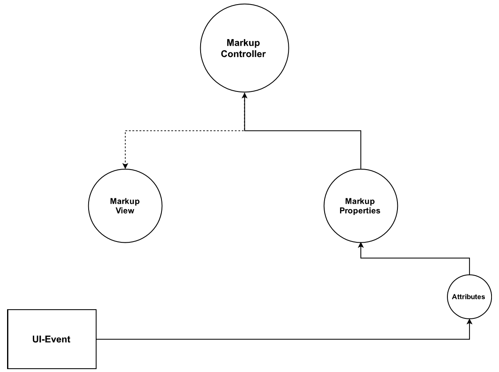

## Implementation

### Control Flow

#### Reacting to Events with rxJava's Observables

Through the usage of rxJava, we can propagate events in a 'pull' based notification-style event system, where one Event can
traverse through each component in the system to another, and so on and so forth. For example, if the user needs to change the color
of the currently selected `Markup`, then the View displaying it must also be updated to display those changes. As well, if the View
creates a new `Markup`, then the properties panel needs to be updated to display it.

As there are many possible events that need to notify other parts of the system, and the fact that events can occur at any time, we need
a way to notify all interested listeners.

#### Events

Events are made up like such...

```java
class Event {
    public final int tag;
    public final Object data;
}
```

The `tag` lets us know what kind of event this is, and the `data` serves as an opaque handler for passing around data, of which the `tag` can
be used to identify the type of. For example, if the `tag` is `CREATE_MARKUP` and we know that this can only be sent from the View, we know then
that `data` holds the type `List<Bounds>` object, and we may safely cast to that. Events such as this can be used to create even more events and 
pass these Events around. The reasoning behind not using subclasses of this type is simple: Unlike other languages, Java does allow pattern matching
based on it's type. Sure, we can use `instanceof`, to determine the exact type, but that's a lot more long-winded than just doing it by tag. As well,
`Event` is a POJO object: A Plain Old Java Object, and as such does not need that much complexity.

#### How do we handle these Events? 

An example of event propagation would be the `MarkupController`, which handles all of the heavy-lifting of the application.
In the below snippet, you can see how it's event handler can be implemented in a very concise, and elegant manner.

```java
observer.onEvent()
    .flatMap(e -> {
        Function<Object, Observable<Event>> dispatchHandler;
        switch (e.tag) {
            case Event.CREATE_MARKUP:
                dispatchHandler = this::createMarkup;
                break;
            case Event.MARKUP_MUTATION:
                dispatchHandler = this::markupMutation;
                break;
            case Event.MARKUP_SELECTION:
                dispatchHandler = this::markupSelection;
                break;
            case Event.FILE_CHANGE:
                dispatchHandler = this::fileChange;
                break;
            case Event.CLOSING:
                dispatchHandler = this::closeHandler;
                break;
            default:
                dispatchHandler = ignored -> Observable::empty;
        }
        return dispatchHandler.apply(e.data);
    })
    .subscribe(this::sendEvent);
```

For those unfamiliar with Java 8, the syntax may look unfamiliar, so I will give an overall summary of what is going on here.

`observer` would be an rxJava `Observable`, which allows push-based notifications, when an event is emitted from the source `Observable`. The source
in this instance would be either from `MarkupView` or `MarkupProperties` as those two are the only ones capable of sending events directly.
By calling `subscribe`, we become an `Observer`, and the callback provided, `this::sendEvent` which is a method we decide who to send the events to,
and therefore propagating, is called on each event emitted. So for example, if the `MarkupView` notified us that the `CREATE_MARKUP` event occurred, we
handle this by calling our `dispatchHandler` and send the resulting event to `MarkupProperties`

Operators, like `flatMap`, provide a new `Observable` that, put simply, will perform those actions before passing onwards. So, `flatMap` will take
the `Event` object, map it and construct a new `Observable`. The reasoning behind creating a new Observable is that the `dispatchHandler` may well perform
some alterations on the pipeline. For example, `fileChange` will handle all I/O operations in a background thread and then continue on the UI Thread, 
and an `Observable` can specify what work should be done on which thread and even coordinate work that way.

The `dispatchHandler` is more for clarity, to help the reader understand what is going on: `Function` is a Java 8 construct that represents a function that
allows application. Application meaning "applying an argument" later. A Method Reference can be safely be stored in a `Function`. A `Function` of type
`Function<T,R>` is a function that takes `T`, and returns `R`. So, `Function<Object, Optional<Event>>` is a function that takes `Object` and returns `Optional<Event>`.
In the `default` statement, a lambda takes the form `(n0, n1, ... nk) -> { }`, but a single argument lambda does not need parenthesis surrounding it. As well a 
single line lambda does not need to be wrapped in a block. A lambda expression can also fit within a `Function`.

While this may seem daunting at first, once understood, it makes code a lot more clean and easy to read.


#### Diagram

To help the reader to understand the significance of this design, let us first look at the graph of all possible UI Events, which again, can happen at any time.


The `MarkupController` is at the top because it is where all events must go to communicate with the other view. `MarkupView` is the view which displays the user's code and allows
the user the ability to create and delete markups, as the like. `MarkupProperties` displays the 'Attributes' of each `Markup`, for example it's message, it's color, and it's identifier.
The `MarkupProperties` contains 4 children, all of which accept UI Events. For example, selecting another `Markup` by it's identifier is such an event, and so is applying a user-provided
template.

#### Concrete Examples of Event Propagation

While the above may seem confusing to the reader, hopefully the below examples can help in providing clarity. We are not going over all possible events, as they
are many, but I will display the more important ones.

##### Create Markup

To create a markup, the user first highlights the code in the view, right clicks, and selects "Create Markup". If the selected boundary is not already occupied with another markup, 
then after segmenting the selected boundary to exclude extra white spaces, it must begin notifying of the event.



1. `MarkupView` receives UI-Event to "Create Markup" from it's context menu
2. `MarkupView` determines if the selected boundary is already occupied by another markup. If it is not occupied, segment selected bounds to exclude excess white spaces
3. `MarkupView` notified `MarkupController` of the event, with the segmented `Bounds`
4. `MarkupController` constructs a new `Markup` with a generated identifier and the passed `Bounds`, then maps it to it's identifier.
5. `MarkupController` notifies `MarkupProperties` of the new `Markup`.
6. `MarkupProperties` notifies `Selector` to update it's list of identifiers and display it.
7. `MarkupProperties` notifies `Attributes` to update it's view with the new `Markup` as the model.

##### Select Markup

Selecting a markup occurs in the `Selector`, and it displays a dropdown menu of all currently existing markups.



1. `Selector` receives UI-Event to change markup based on id.
2. `Selector` constructs an event composed of the selected identifier, then notifies it's parent `MarkupProperties`
3. `MarkupProperties` notifies `MarkupController`
4. `MarkupController` finds the `Markup` by the selected identifier, then notifies `MarkupProperties` of a change.
5. `MarkupProperties` notifies `Attributes` to update it's view based on the passed Model.
6. `MarkupController` notifies `MarkupView` of this change by constructing an event that is composed of the `Markup` boundary.
7. `MarkupView` sets cursor to the start and end postion of the passed `Bounds`

##### Apply Templates

Applying a template occurs in the tabbed view, and is invoked by double clicking on the `TreeView` leaf.



1. `Templates` receives UI-Event to apply template
2. `Templates` constructs an event composed of the partially filled `Markup` used as the template, and notifies `MarkupProperties`
3. `MarkupProperties` notifies `Attributes` to update it's view based on the partially filled `Markup`
4. `MarkupProperties` notifies `MarkupController` which updates it's `Markup` based on the template
5. `MarkupController` checks if the template changed the color, and if so, notifies `MarkupView` with an event composed of the boundary and new color.
6. `MarkupView` updates color of highlights within passed `Bounds`

##### File Change

A file change, also triggered from double clicking a `TreeView` in the 'Files' tab, is rather complicated. Firstly, the file change needs to update the current
user session, and by doing that it needs to do some I/O. Because I/O should never be done one the UI Thread, we need to compose it on the background thread, and that becomes
difficult if a UI event can occur at any given time. Doing I/O on the UI thread will cause a stall in user performance, which is unacceptable, but race conditions can arise
when the background thread is reading and writing I/O and the user triggers another event. This is why the original solution of using Guava's `EventBus` would not work, but with
rxJava it can because events are sent sequentially, even if it is on a background thread.

To summarize the issue of this using an `EventBus`, it arises when we need to force the UI Thread to not do any more work until after work is finished on the background thread. Now,
the UI thread should not block, and so it should continue processing other UI Events, and also it needs to continue where it left off after the background threead finished. As well,
imagine another scenario where the user decides to do a file change, and double clicks on two different files at the same time: What happens is that it sends two different 'File Change'
events on the `EventBus` and spawns two background threads, each of which is going to be attempting to write to the same file, and while file access is serialized, both will end up attempting
to get the attention of the UI Thread and will leave the program in an undefined state.

`File` needs to read the contents of the selected file on disk before continuing, and since there is only one background thread, all subsequent File Change events must wait anyway until the
background thread finishes it's current task. The `MarkupController` must also first write all `Markup` instance to disk for this file before continuing AND read all `Markup` instances of the new file,
on the same background thread, and again, all subsequent File Change events must wait. Hence, it becomes free of race conditions.



1. `Files` recevies UI-Event to apply template
2. `Files` schedules the background thread to read the selected `File` in advance.
3. `Files` constructs an event of the contents of the selected `File`, and notifies `MarkupProperties`
4. `MarkupProperties` notifies `MarkupController`
5. `MarkupController` schedules the background thread to read the session data in, get the new file's session data and update for the old one
6. `MarkupController` constructs an event composed of the list of `Markup`s to `MarkupProperties`
7. `MarkupProperties` constructs an event composed of list of identifier and notifies `Selector`
8. `Selector` updates it's list of identifiers with the event's list.
9. `MarkupProperties` notifies `Attributes` to clear it's currently displayed data
10. `Attributes` clears displayed data.
11. `MarkupController` notifies `MarkupView` with list of pairs of lists of `Bounds` and `Color` for each `Markup` restored. 


##### Mutate Markup

Mutating the currently selected `Markup` is done through `Attributes`. It's simpler than a few examples of the above.



1. `Attributes` receives UI-Event to mutate current `Markup`
2. `Attributes` constructs an event composed of partially applied `Markup` based on the changed information and notifies `MarkupProperties`
3. `MarkupProperties` notifies `MarkupController`
4. `MarkupController` applies these changes to the currently selected `Markup`
5. `MarkupController` notifies `MarkupView` if the color changed.
6. `MarkupView` changes the color of the markup highlights.