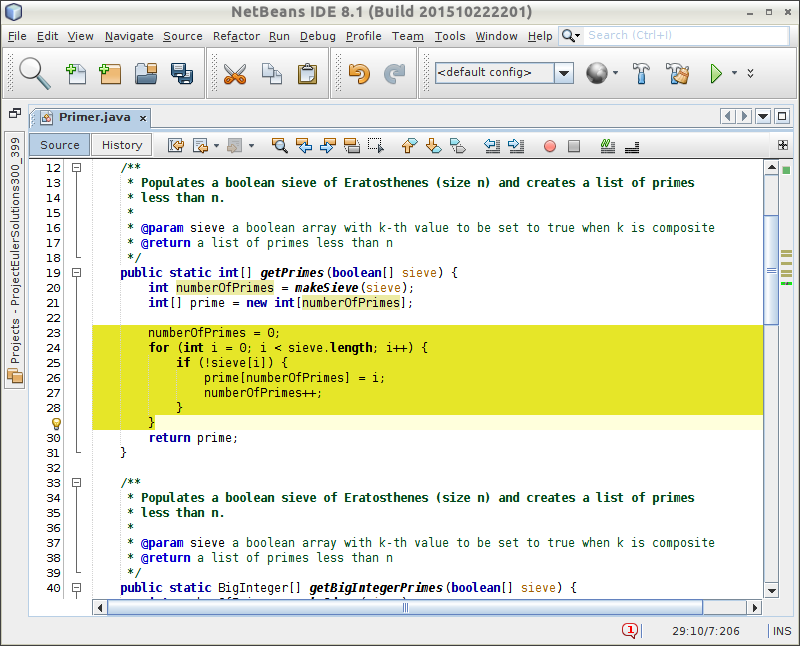
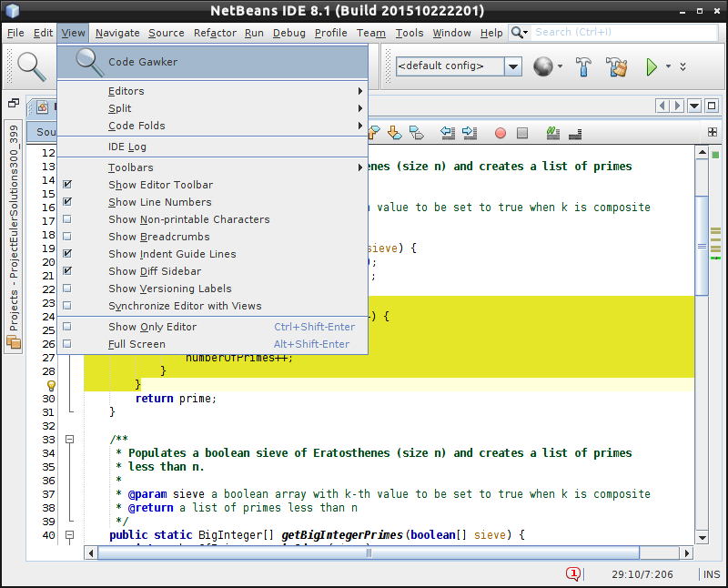
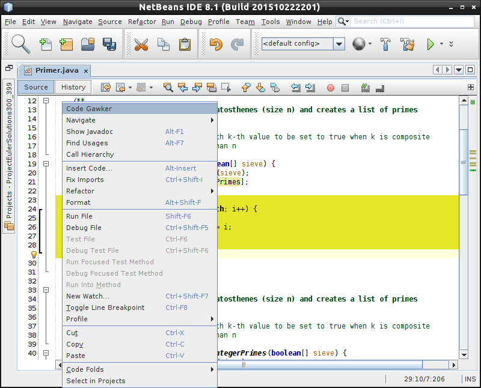
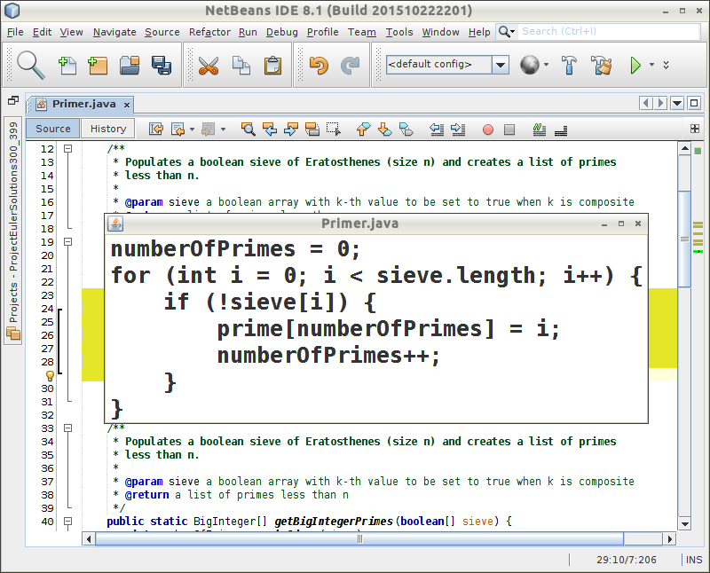
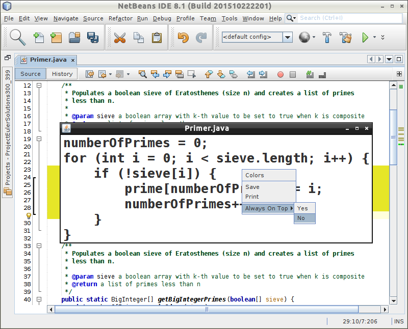
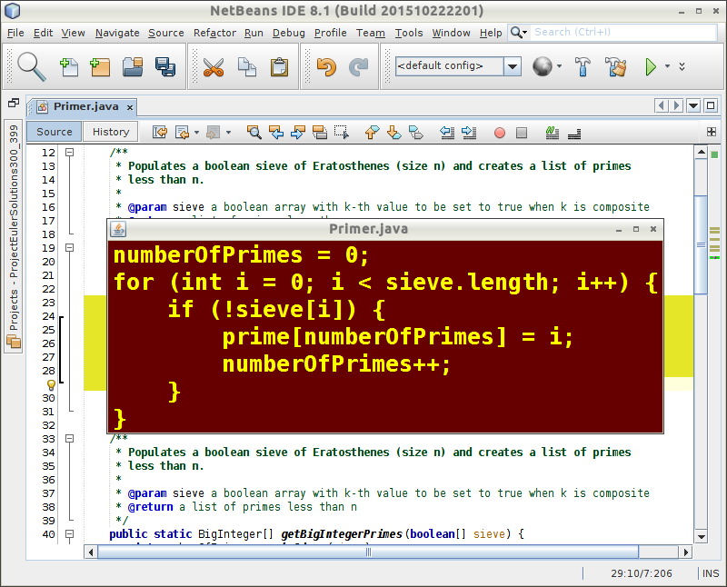
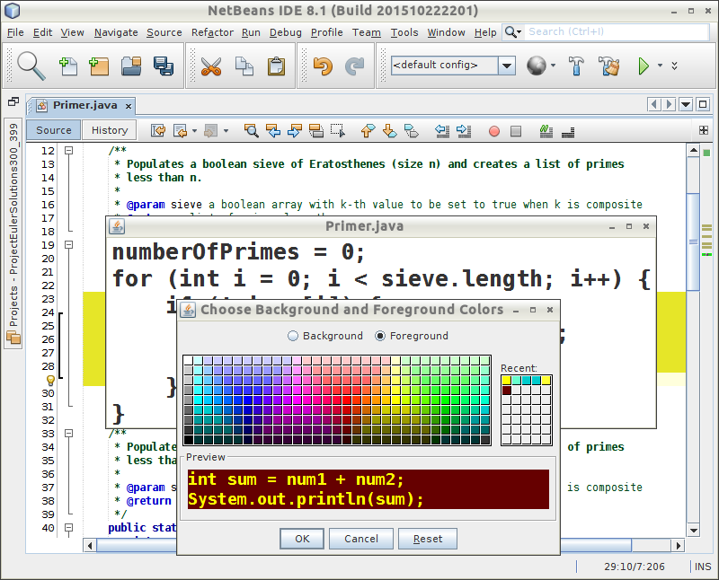

# Code Gawker

**Code Gawker** is a NetBeans IDE plug-in that displays selected source code in a separate top-level customizable window. It can be used by an instructor of a programming class for making easy side-by-side comparisons of code fragments from different source files or from different parts of the same source file. 

<h4>Usage</h4>

Use the mouse to highlight a code fragment to be displayed:

&nbsp; &nbsp; &nbsp; &nbsp; &nbsp; &nbsp; 

Create a window containing the selected fragment by clicking on the <strong>Code Gawker</strong> icon in the IDE's menu bar or by selecting **Code Gawker** from the View menu:

&nbsp; &nbsp; &nbsp; &nbsp; &nbsp; &nbsp; 

Alternatively, right click in the editor window and select **Code Gawker** from the context menu:

&nbsp; &nbsp; &nbsp; &nbsp; &nbsp; &nbsp; 

A top-level window is created containing the highlighted text:

&nbsp; &nbsp; &nbsp; &nbsp; &nbsp; &nbsp; 

The **Code Gawker** window provides several options through a context menu:

&nbsp; &nbsp; &nbsp; &nbsp; &nbsp; &nbsp; 

Selects Colors for a dialog to set the background and foreground colors:

&nbsp; &nbsp; &nbsp; &nbsp; &nbsp; &nbsp; 

Change the font size by resizing the window. The code fragment will always span the height of the window, and its width will be adjusted to fit the text precisely. 

&nbsp; &nbsp; &nbsp; &nbsp; &nbsp; &nbsp; 

See the <a href="https://github.com/dcoles-bloomu/code-gawker/wiki">**Code Gawker** wiki</a> for implementation details and possible future enhancements.

