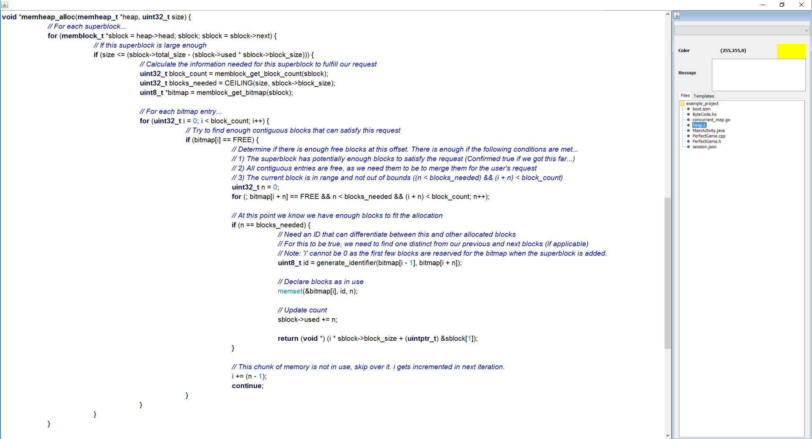
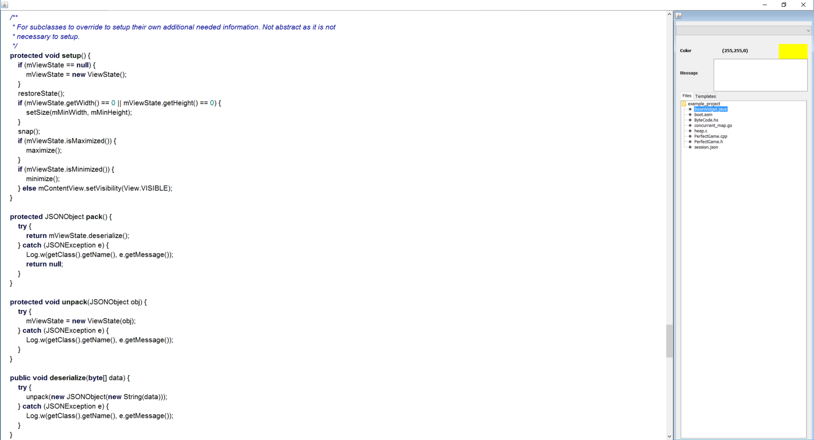
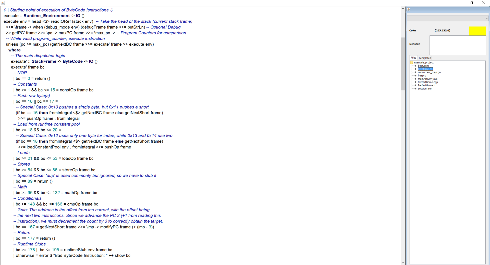
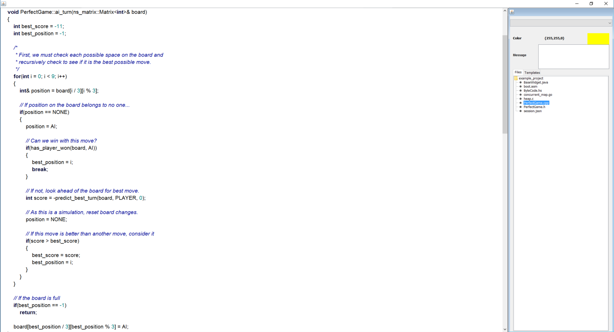
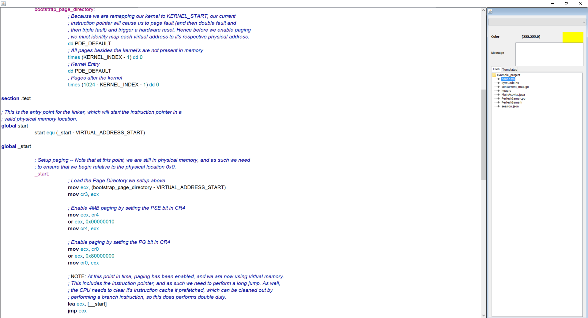
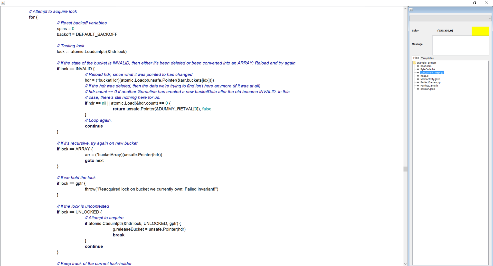

# Code Glosser

## Summary

Code Glosser is an academic-enrichment tool that provides a user-friendly way for instructors to markup student assignments and provide the necessary feedback
for their students. Markups are used to provide feedback to students who need it and 'highlight' code similar to how a yellow marker would. This highlighting
makes it easy for students to determine precisely where the instructor deemed that feedback was necessary.

## Features

### Portability

Code Glosser is it's own stand-alone application, available to anyone with the Java Runtime Environment. Code Glosser is meant to be portable not only for instructors, which
require the application to markup code, but as well for the recipient of those markups, who can view those markups in HTML. Neither the application nor the exported markups
require a network connection to use.

### Effortless Feedback

Markups may also be applied directly from user-provided templates, which are imported from a JSON file. Templates are a quick and easy way to save time by recycling commonly-made
mistakes by students, and is one of the greatest points of this project, as the amount of time and effort saved from this feature cannot be understated. One of the problems
today with grading is that professors will not leave feedback on a user's assignment because of the sheer amount of effort it takes to write them, while those that do normally
go about it the wrong way, even going as far as printing out programs just to write on them. By applying feedback in such a few clicks, makes both grading and leaving
feedback at the same time almost effortless.

### Mass-Grading

Code Glosser allows the ability to not only markup a single file, but multiple files, and in fact, an entire project. Code Glosser allows you to switch between project files
while also preserving markups between files, and even export them all at once. So not only is marking up individual files extremely fast, but it turns a nightmare of grading
multiple project files into a much more manageable one. Projects are exported as zip archives for easy distribution.

### Syntax Highlighting (Powered by Highlight.js)

Syntax highlighting, being a requirement these days for viewing code, is provided for all languages that [highlight.js](https://highlightjs.org/) supports, as well as their themes.
Syntax highlighting is provided in a manner that can be used offline, and so currently supports 169 languages that it does. Highlighting is done once by executing the highlight.js
JavaScript in JavaFX (Locally) and thereafter the CSS is directly injected into the HTML web page.

## Screenshots

### Demo

A demo of the project's usage can be seen below.

### Syntax Highlighting

Below are screenshots of various projects I have worked in the past that are displayed inside of Code-Glosser. All are powered by [highlight.js](https://highlightjs.org/).

#### C

#### Java (Android)

#### Haskell

#### C++

#### x86 Assembly

#### Go

