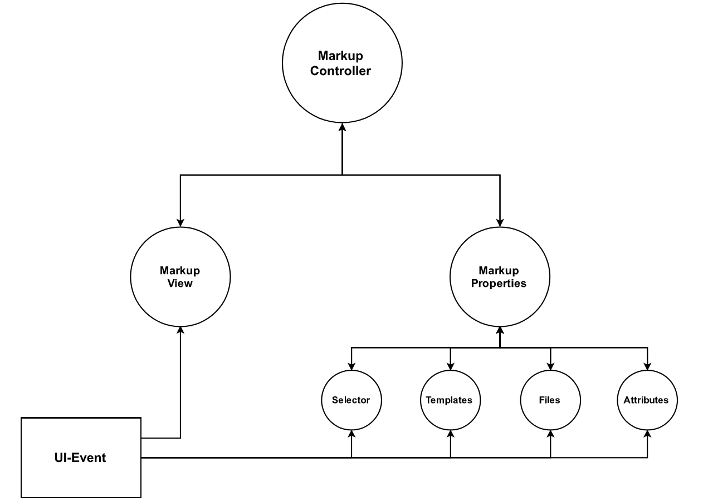

# Code Glosser (Rough Draft)

## What is it?

A tool for instructors to markup student code. Leave feedback by marking up code by leaving messages, which the user can see in HTML.
There is currently minimal support for project-wide markups.

## Features

### NetBeans Integration

Will be available soon on NetBeans Plugin-Portal soon, and hence will be readily available.

### Markup and Evaluate Code

Markup student code by leaving notes, which they will be able to see in HTML. 

### Export Markups to HTML Format

Export marked-up code as HTML. Marked up code appears as being highlighted, and display the message on hover.

Powered By: 'highlight.js'

#### Markup Entire Projects

##### Project Files View

##### Add Markup (Custom)

##### Add Markup (Template)

##### Color-Distinct Markups

## Implementation

### Control Flow

#### Reactive MVC

#### Events

##### Create Markup

##### Show Markup

##### Double and Triple Click

##### Delete Markup

##### Modify Markup

